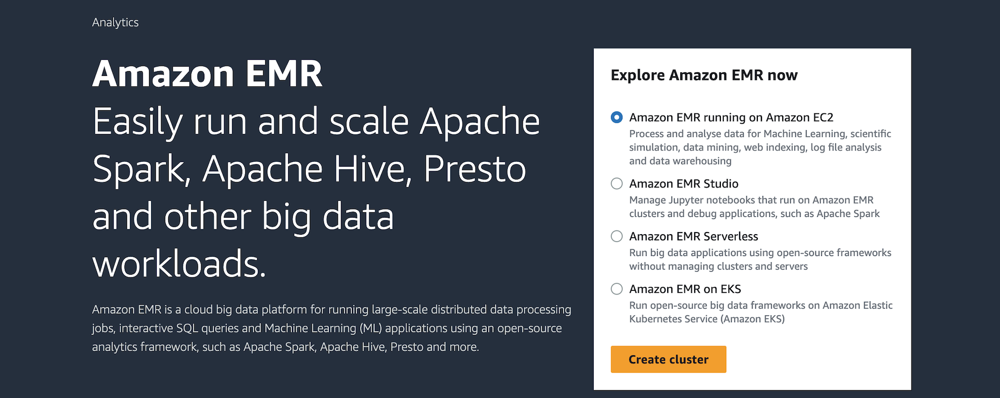

[[English](README.md)] [[한국어](README.ko.md)]

# Amazon EMR (Elastic MapReduce)
[Amazon EMR](https://aws.amazon.com/emr/) is the industry-leading cloud big data solution for petabyte-scale data processing, interactive analytics, and machine learning using open-source frameworks such as Apache Spark, Apache Hive, and Presto.



## Examples
- [Amazon SageMaker Blueprint](https://github.com/Young-ook/terraform-aws-sagemaker/tree/main/examples/blueprint)
- [Analytics on AWS](https://github.com/Young-ook/terraform-aws-emr/tree/main/examples/blueprint)
- [Data on Amazon EKS](https://github.com/Young-ook/terraform-aws-eks/blob/main/examples/data-ai)

## Getting started
### AWS CLI
Follow the official guide to install and configure profiles.
- [AWS CLI Installation](https://docs.aws.amazon.com/cli/latest/userguide/cli-chap-install.html)
- [AWS CLI Configuration](https://docs.aws.amazon.com/cli/latest/userguide/cli-configure-profiles.html)

After the installation is complete, you can check the aws cli version:
```
aws --version
aws-cli/2.5.8 Python/3.9.11 Darwin/21.4.0 exe/x86_64 prompt/off
```

### Terraform
Terraform is an open-source infrastructure as code software tool that enables you to safely and predictably create, change, and improve infrastructure.

#### Install
This is the official guide for terraform binary installation. Please visit this [Install Terraform](https://learn.hashicorp.com/tutorials/terraform/install-cli) website and follow the instructions.

Or, you can manually get a specific version of terraform binary from the websiate. Move to the [Downloads](https://www.terraform.io/downloads.html) page and look for the appropriate package for your system. Download the selected zip archive package. Unzip and install terraform by navigating to a directory included in your system's `PATH`.

Or, you can use [tfenv](https://github.com/tfutils/tfenv) utility. It is very useful and easy solution to install and switch the multiple versions of terraform-cli.

First, install tfenv using brew.
```
brew install tfenv
```
Then, you can use tfenv in your workspace like below.
```
tfenv install <version>
tfenv use <version>
```
Also this tool is helpful to upgrade terraform v0.12. It is a major release focused on configuration language improvements and thus includes some changes that you'll need to consider when upgrading. But the version 0.11 and 0.12 are very different. So if some codes are written in older version and others are in 0.12 it would be great for us to have nice tool to support quick switching of version.
```
tfenv list
tfenv install latest
tfenv use <version>
```

### Setup
```
module "emr" {
  source  = "Young-ook/emr/aws"
  name    = "emr"
}
```
Run terraform:
```
terraform init
terraform apply
```

# Additional Resources
## Amazon EMR (Elastic MapReduce)
- [Amazon EMR Migration TCO(Total Cost of Ownership) Simulator](https://github.com/awslabs/migration-hadoop-to-emr-tco-simulator)

## Data Lake
- [Data Lake](https://en.wikipedia.org/wiki/Data_lake)
- [What is a data lake?](https://aws.amazon.com/big-data/datalakes-and-analytics/what-is-a-data-lake/)
- [Introduction to Data Lakes](https://www.databricks.com/discover/data-lakes)

## Data Mesh
- [Data Mesh: A Monolithic Data Lake to a Distributed Data Mesh](https://martinfowler.com/articles/data-monolith-to-mesh.html)
- [Data Mesh Architecture](https://www.datamesh-architecture.com/)
- [Amazon DataZone - Data Mesh and Modern Data Architecture on AWS](https://youtu.be/arA-s8GTs6c?si=BsYUgAWNLrbsGbi8)
