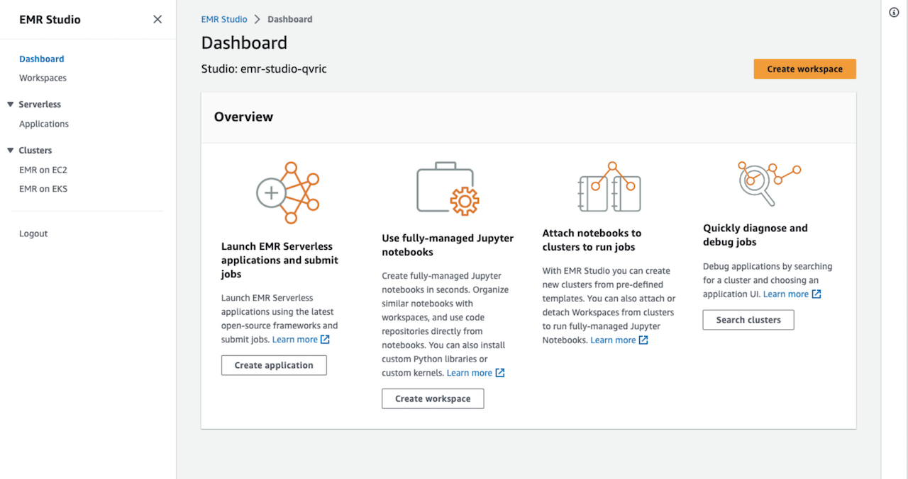

[[English](README.md)] [[한국어](README.ko.md)]

# 데이터 레이크 블루프린트 (Data Lake Bluprint)
이 데이터 레이크 블루프린트 예제는 워크로드를 배포하고 운영하는 데 필요한 운영 소프트웨어를 포함하여 자동으로 EMR 및 Redshift 클러스터를 구성하는 데 도움을 줍니다. 이 블루프린트 예제를 활용하면 EMR/Redshift 클러스터 기반의 분석 플랫폼에 대한 구성을 IaC(Infrastructure as Code) 템플릿/블루프린트로 설명할 수 있습니다. 블루프린트가 구성되면 이를 사용하여 Jenkins, CodePipeline과 같은 자동화 워크플로 도구를 사용하여 여러 AWS 계정 및 리전 전반에서 일관된 환경을 스탬핑할 수 있습니다. 또한, 이 블루프린트를 사용하여 Hadoop, Spark 등과 같이 널리 사용되는 다양한 오픈 소스 분석 솔루션을 EMR 위에 구성하거나, Redshift 클러스터를 쉽게 구성할 수 있습니다. 또한, 데이터 레이크 블루프린트는 여러 팀의 워크로드를 운영하는 데 필요한 관련 보안 제어를 구현 방법을 보여 줍니다.


## 설치
### 필수요소
이 모듈에는 EMR on EKS 클러스터 관리를 위한 오픈 소스 명령줄 도구인 *eksctl*이 필요합니다. 이 예제에서는 *eksctl*을 사용하여 EMR 연동을 위한 쿠버네티스 접근 제어 오브젝트를 생성합니다. [설치 안내](https://github.com/weaveworks/eksctl#installation)에 따라 eksctl을 설치합니다. 사용 중인 환경에 테라폼 및 쿠버네티스 도구가 없는 경우, [설치 안내서](https://github.com/Young-ook/terraform-aws-eks)의 안내를 따르시길 바랍니다.

:warning: **이 예제는 eksctl 0.135.0 또는 그 이상 버전이 필요합니다**

### 내려받기
여러 분의 작업 환경에 예제를 내려받기 합니다.
```
git clone https://github.com/Young-ook/terraform-aws-emr
cd terraform-aws-emr/examples/blueprint
```

작업이 끝나면 **blueprint** 디렉토리를 볼 수 있습니다. 디렉토리 안에 있는 예제에는 EMR 클러스터와 추가 요소를 설치하고 관리하기 위한 테라폼 설정 파일과 기타 자원이 있습니다. 다음 단계로 넘어가기 전에 테라폼 제대로 설치 되어 있는 지 확인합니다. 다음 단계로 이동하기 전 테라폼이 설치 되어 있는 지 확인합니다. 아직 테라폼을 설치하지 않았다면 이 저장소의 메인 [페이지](https://github.com/Young-ook/terraform-aws-emr)로 이동하여 설치 안내를 따라 설치하시기 바랍니다.

테라폼을 실행합니다:
```
terraform init
terraform apply
```
또는, *-var-file* 옵션을 활용하여 원하는 파라메터를 전달할 수 있습니다.
```
terraform plan -var-file fixture.tc1.tfvars
terraform apply -var-file fixture.tc1.tfvars
```

특별하게 원하는 AWS 리소스만 생성할 하고 싶을 때는 *-target* 옵션을 사용할 수 있습니다. 예를 들어, 아래 테라폼 명령어를 사용하면 블루프린트 예제에서 EMR 스튜디오 인스턴스만 생성할 수 있습니다.
```
terraform apply -target module.vpc -target module.emr-studio
```
마찬가지로, main.tf 구성 파일에 설명된 모든 리소스를 생성하지 않고 Redshift 클러스터만 생성하려는 경우 다음과 같은 명령을 실행하면 됩니다:
```
terraform apply -target module.vpc -target module.redshift
```

## EMR 스튜디오 (EMR Studio)
로그인하면 EMR 스튜디오 콘솔로 리디렉션됩니다. 이전 단계에서 생성한 *emr-studio-xxxxx/emr-studio* 스튜디오가 준비된 것을 확인할 수 있습니다. 이제 EMR 스튜디오가 준비되었으니 다음 단계로 진행하여 스튜디오 작업 영역(Workspace)를 생성해 보겠습니다.


EMR 스튜디오에 로그인하면 다양한 작업 영역을 만들고 구성하고 노트북을 실행할 수 있습니다. 작업 영역은 Amazon EMR Studio의 주요 구성 요소입니다.

* 작업 영역 만들기 버튼 중 하나를 클릭하여 작업 영역 만들기 대화 상자를 시작합니다.
* 아래 표시된 대로 모든 필수 정보를 입력합니다. EMR 클러스터를 생성하거나 기존 EMR 클러스터에 할당하는 동안 작업 영역을 생성할 수 있습니다. 이 단계에서는 기본값(선택 옵션 없음)을 유지합니다.




## Amazon EMR on Amazon EKS
Amazon EMR on Amazon EKS는 컨테이너 기반 접근 방식을 사용하여 분석 작업과 작업을 처리하는 서비스 및 인프라로부터 분리 시킵니다. EMR on EKS는 작업의 컴퓨팅, 메모리 및 애플리케이션 종속성에 따라 인프라를 동적으로 구성하므로 인프라 운영은 줄이고 애플리케이션 개발에 더 집중할 수 있게 합니다. 인프라 팀은 공통 컴퓨팅 플랫폼을 중앙에서 관리하여 EMR 워크로드를 다른 컨테이너 기반 애플리케이션과 통합할 수 있습니다. 여러 팀, 조직 또는 사업부는 공유 인프라에서 분석 프로세스를 독립적이면서도 동시 다발적으로 실행하면서 Amazon EKS 및 AWS IAM(Identity and Access Management)을 통해 격리를 유지할 수 있습니다. Amazon EMR에 작업을 제출할 때, 작업 정의에는 애플리케이션별 매개변수가 모두 포함됩니다. Amazon EMR은 이러한 매개변수를 사용하여 배포할 포드 및 컨테이너를 Amazon EKS에 지시합니다. 그런 다음 Amazon EKS는 작업을 실행하는 데 필요한 Amazon EC2 및 AWS Fargate의 컴퓨팅 리소스를 온라인으로 가져옵니다. 이러한 느슨한 서비스 결합을 통해 안전하게 격리된 여러 개의 작업을 동시에 실행할 수 있습니다. 또한 동일한 작업을 다른 컴퓨팅 백엔드로 벤치마킹하거나 여러 가용 영역에 작업을 분산하여 가용성을 향상시킬 수도 있습니다.


다음 다이어그램은 Amazon EMR on EKS가 다른 AWS 서비스와 어떻게 연동하는 지 보여줍니다.


이미 Amazon EMR을 사용하고 있는 경우, 이제 동일한 Amazon EKS 클러스터에서 다른 유형의 애플리케이션과 함께 Amazon EMR 기반 애플리케이션을 실행할 수 있습니다. 이 배포 옵션은 또한 리소스 활용도를 개선하고 여러 가용 영역에서 인프라 관리를 간소화합니다. 이미 Amazon EKS에서 빅데이터 프레임워크를 실행 중인 경우, 이제 Amazon EMR을 사용하여 프로비저닝 및 관리를 자동화하고 Apache Spark를 더 빠르게 실행할 수 있습니다.

이미 Amazon EKS에서 Apache Spark를 실행 중인 경우, 자동 프로비저닝 및 확장, 최신 완전 관리형 버전의 오픈 소스 빅 데이터 분석 프레임워크 사용 기능 등 Amazon EMR의 모든 이점을 누릴 수 있습니다. Apache Spark에 최적화된 EMR 런타임을 통해 EKS위에 직접 운영하는 오픈 소스 Apache Spark보다 3배 빠른 성능을 기대할 수 있으며, EMR Studio 및 Apache Spark UI를 통한 서버리스 데이터 과학 환경, 세분화된 데이터 액세스 제어, 데이터 암호화 지원 등의 이점을 누릴 수 있습니다. EC2 기반 배포와 달리 몇 분에서 몇 초 만에 Spark 작업을 시작할 수 있습니다.

다음 다이어그램은 Amazon EMR의 두 가지 배포 모델을 보여줍니다.


## 컴퓨팅 옵션들
### AWS 그래비톤 (Graviton)
[AWS 그래비톤 (Graviton)](https://aws.amazon.com/ec2/graviton/) 프로세서는 Amazon EC2에서 실행되는 클라우드 워크로드를 최고의 가격 대비 성능을 제공하기 위해 64비트 ARM Neoverse 코어를 사용하여 Amazon Web Services에서 맞춤 제작한 했습니다. 새로운 범용(M6g), 컴퓨팅 최적화(C6g), 메모리 최적화(R6g) 인스턴스는 웹 서버, 컨테이너형 마이크로서비스, 캐싱 플릿, 분산 데이터 스토어와 같은 스케일아웃 및 Arm 기반 애플리케이션을 위해 동급의 현세대 x86 기반 인스턴스 대비 최대 40% 향상된 가격 대비 성능을 제공하며, 광범위한 Arm 에코시스템에서 지원됩니다. 클러스터 내에서 x86 및 Arm 기반 EC2 인스턴스를 혼합할 수 있으며, 기존 환경에서 Arm 기반 애플리케이션을 쉽게 평가할 수 있습니다. 다음은 AWS Graviton 사용을 시작하는 방법에 대한 유용한 [시작하기](https://github.com/aws/aws-graviton-getting-started) 가이드입니다. AWS Graviton 프로세서를 위한 애플리케이션 빌드, 실행 및 최적화 방법에 대한 자세한 내용을 GitHub 저장소의 가이드에서 확인할 수 있습니다.


*source*: [AnandTech](https://www.anandtech.com/show/15578/cloud-clash-amazon-graviton2-arm-against-intel-and-amd)

이 예제에서 여러 분은 AWS 그래비톤 기반의 노드 그룹으로 구성된 EMR 클러스터를 만들 수 있습니다. 아래와 같이 AWS 그래비톤 기반 인스턴스를 사용하도록 구성하는 설정 템플릿을 사용하면 ARM64 및 AMD64 아키텍처 기반 인스턴스를 모두 생성할 수 있습니다.
```
terraform apply -var-file fixture.graviton.tfvars
```

## 저장소
Amazon S3(Simple Storage Service)는 업계 최고의 확장성, 데이터 가용성, 보안 및 성능을 제공하는 객체 스토리지 서비스입니다. 이 예제에서는 분석 데이터 보관을 위하여 S3 버킷을 사용합니다. 그리고 s3 수명 주기 구성을 활용하여 오브젝트 액세스 패턴에 따라 스토리지 클래스를 자동으로 전환하는 인텔리전트 계층화를 활성화할 수 있습니다. 이는 대용량의 데이터를 분석해야 하는 데이터 레이크 스토리지 비용을 가장 쉽게 줄일 수 있는 방법이기 때문에 중요합니다.


## 애플리케이션
- [EMR Serverless Examples](https://github.com/aws-samples/emr-serverless-samples/tree/main/examples)
- [PySpark Pi](./apps/README.md#pi)
- [Tickit](./apps/README.md#tickit)

## 정리
예제를 삭제하기 위하여 테라폼 명령을 실행합니다:
```
terraform destroy
```

삭제 명령을 수행하기 전에 재차 확인하는 과정이 있는데, 이 부분을 바로 넘기려면 테라폼 옵션을 활용할 수 있습니다.
```
terraform destroy --auto-approve
```

**[주의]** 여러 분이 자원을 생성할 때 *-var-file*을 사용했다면, 삭제 할 때에도 반드시 같은 변수 파일을 옵션으로 지정해야 합니다.
```
terraform destroy -var-file fixture.tc1.tfvars
```

# 추가 정보
## Apache Spark on AWS considerations


## AWS Lake Formation
- [Integration Amazon EMR with AWS Lake Formation](https://docs.aws.amazon.com/emr/latest/ManagementGuide/emr-lake-formation.html)
- [AWS Lake Formation Workshop](https://catalog.us-east-1.prod.workshops.aws/workshops/78572df7-d2ee-4f78-b698-7cafdb55135d/en-US)
