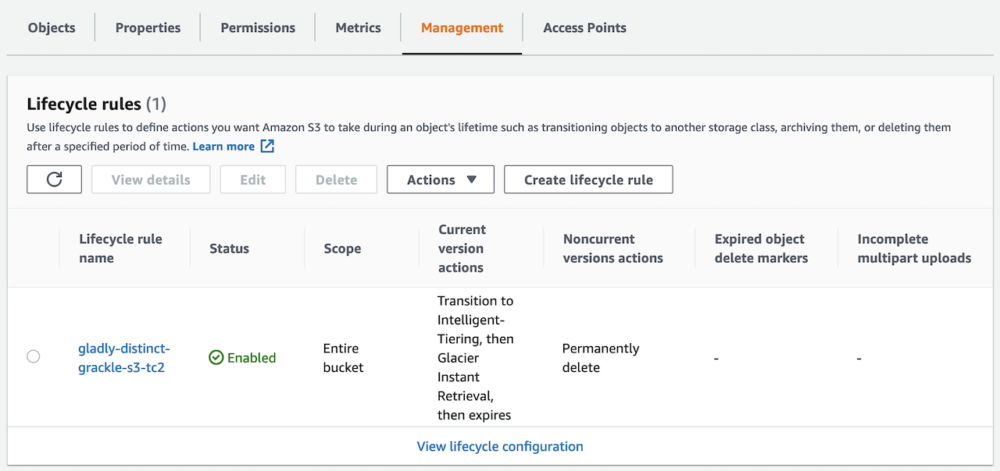
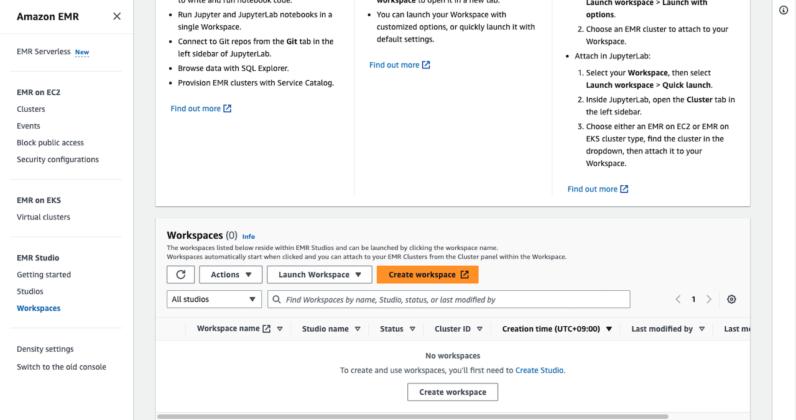
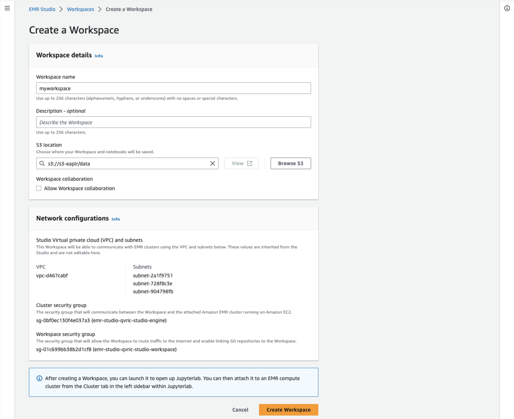
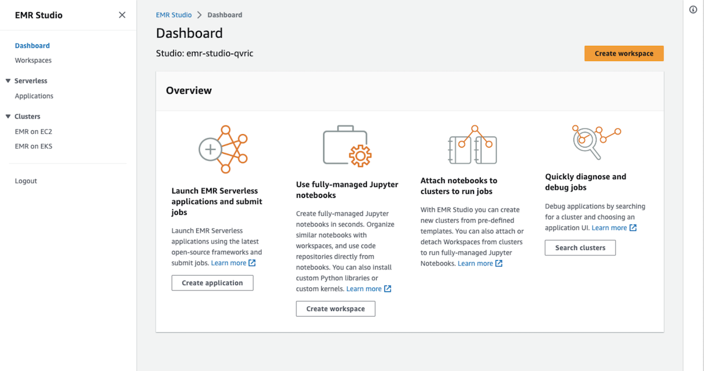

[[English](README.md)] [[한국어](README.ko.md)]

# EMR Bluprint
This is EMR Blueprint example helps you compose complete EMR clusters that are fully bootstrapped with the operational software that is needed to deploy and operate workloads. With this EMR Blueprint example, you describe the configuration for the desired state of your analytics platform with EMR clusters, such as the control plane, worker nodes, as an Infrastructure as Code (IaC) template/blueprint. Once a blueprint is configured, you can use it to stamp out consistent environments across multiple AWS accounts and Regions using your automation workflow tool, such as Jenkins, CodePipeline. Also, you can use EMR Blueprint to easily bootstrap an EMR cluster with a wide range of popular open-source analytics solutions such as Hadoop, Spark and more. EMR Blueprint also helps you implement relevant security controls needed to operate workloads from multiple teams in the same cluster.

## Setup
### Download
Download this example on your workspace
```
git clone https://github.com/Young-ook/terraform-aws-emr
cd terraform-aws-emr/examples/blueprint
```

Then you are in **blueprint** directory under your current workspace. There is an exmaple that shows how to use terraform configurations to create and manage an EMR cluster and utilities on your AWS account. Check out and apply it using terraform command. If you don't have the terraform tool in your environment, go to the main [page](https://github.com/Young-ook/terraform-aws-emr) of this repository and follow the installation instructions before you move to the next step.

Run terraform:
```
terraform init
terraform apply
```
Also you can use the *-var-file* option for customized paramters when you run the terraform plan/apply command.
```
terraform plan -var-file fixture.tc1.tfvars
terraform apply -var-file fixture.tc1.tfvars
```

## Computing options
### AWS Graviton
[AWS Graviton](https://aws.amazon.com/ec2/graviton/) processors are custom built by Amazon Web Services using 64-bit ARM Neoverse cores to deliver the best price performance for you cloud workloads running on Amazon EC2. The new general purpose (M6g), compute-optimized (C6g), and memory-optimized (R6g) instances deliver up to 40% better price/performance over comparable current generation x86-based instances for scale-out and Arm-based applications such as web servers, containerized microservices, caching fleets, and distributed data stores that are supported by the extensive Arm ecosystem. You can mix x86 and Arm based EC2 instances within a cluster, and easily evaluate Arm-based application in existing environments. Here is a useful [getting started](https://github.com/aws/aws-graviton-getting-started) guide on how to start to use AWS Graviton. This github repository would be good point where to start. You can find out more details about how to build, run and optimize your application for AWS Graviton processors.


*source*: [AnandTech](https://www.anandtech.com/show/15578/cloud-clash-amazon-graviton2-arm-against-intel-and-amd)

In this example, you can launch your EMR cluster with AWS Graviton based node groups using the another fixture template that configures to only use AWS Graviton based instances. This stap will create Graviton based instances for better performance/price analytics computing example.
```
terraform apply -var-file fixture.graviton.tfvars
```

## Storage
Amazon S3 (Simple Storage Service) is an object storage service that offers industry-leading scalability, data availability, security, and performance. In this blueprint, you use an s3 bucket for machine learning datas. And you can utilize s3 lifecycle configuration to enable intelligent-tiering that switches storage classes automatically based on object access pattern. This is important because it is easist way to reduce the storage cost of large volume datas for mahcine learning workloads.



## EMR Studio
Upon login, it will redirect you to the EMR Studio console. You will notice that the *emr-studio-xxxxx/emr-studio* studio which you created in the previous step is ready. Your EMR Studio is now ready. Let's proceed to the next step to create a studio workspace.



When you are logged in to an Amazon EMR Studio, you can create and configure different Workspaces to organize and run notebooks. Workspaces are the primary building blocks of Amazon EMR Studio.

* Launch the Create a Workspace dialog box by clicking on any of the Create Workspace buttons.
* Provide all the required information as shown below. You can create the workspace while creating an EMR cluster or assigning it to an existing EMR cluster. For this step, let's keep the default (no checked option).





## Clean up
To destroy all infrastrcuture, run terraform:
```
terraform destroy
```

If you don't want to see a confirmation question, you can use quite option for terraform destroy command
```
terraform destroy --auto-approve
```

**[DON'T FORGET]** You have to use the *-var-file* option when you run terraform destroy command to delete the aws resources created with extra variable files.
```
terraform destroy -var-file fixture.tc1.tfvars
```

# Additional Resources
## Amazon EMR Studio
- [EMR Studio](https://github.com/Young-ook/terraform-aws-emr/tree/main/modules/studio/)

## AWS Lake Formation
- [Integration Amazon EMR with AWS Lake Formation](https://docs.aws.amazon.com/emr/latest/ManagementGuide/emr-lake-formation.html)
- [AWS Lake Formation Workshop](https://catalog.us-east-1.prod.workshops.aws/workshops/78572df7-d2ee-4f78-b698-7cafdb55135d/en-US)
