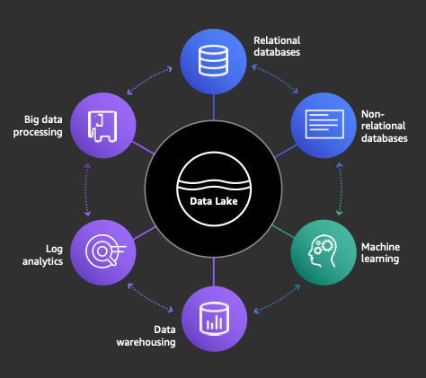
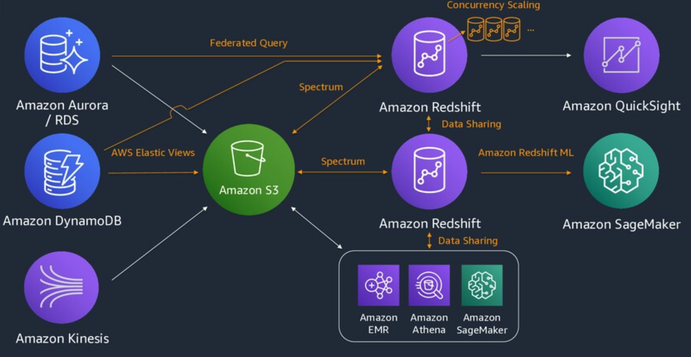
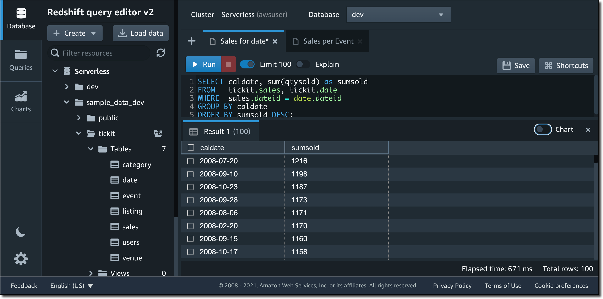
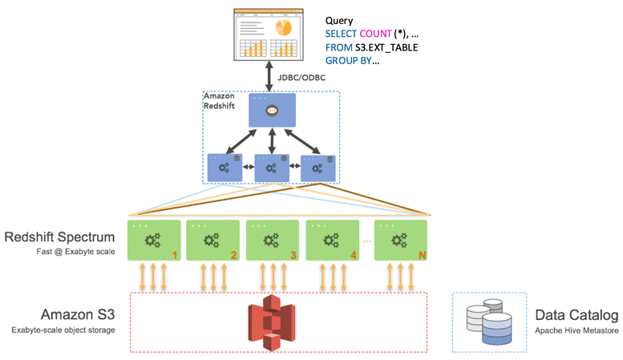

[[English](README.md)] [[한국어](README.ko.md)]

# Data Lake Bluprint
This is Data Lake Blueprint example helps you compose complete EMR and Redshift clusters that are fully bootstrapped with the operational software that is needed to deploy and operate workloads. With this Blueprint example, you describe the configuration for the desired state of your analytics platform with EMR/Redshift clusters as an Infrastructure as Code (IaC) template/blueprint. Once a blueprint is configured, you can use it to stamp out consistent environments across multiple AWS accounts and Regions using your automation workflow tool, such as Jenkins, CodePipeline. Also, you can use this Blueprint to easily bootstrap Redshift clusters or EMR with a wide range of popular open-source analytics solutions such as Hadoop, Spark and more. Data Lake Blueprint also helps you implement relevant security controls needed to operate workloads from multiple teams in your analytics platform.



## Setup
### Prerequisites
This module requires *eksctl* which is an open-source cli tool for EMR on EKS cluster management. In this example, we will use *eksctl* to create kubernetes access control objects for EMR integration. Follow the [instructions](https://github.com/weaveworks/eksctl#installation) for eksctl installation. And if you don't have the terraform and kubernetes tools in your environment, go to the [install guide](https://github.com/Young-ook/terraform-aws-eks) and follow the instructions.

:warning: **This example requires the eksctl version 0.135.0 or higher**

### Download
Download this example on your workspace
```
git clone https://github.com/Young-ook/terraform-aws-emr
cd terraform-aws-emr/examples/blueprint
```

Then you are in **blueprint** directory under your current workspace. There is an exmaple that shows how to use terraform configurations to create and manage an EMR cluster and utilities on your AWS account. Check out and apply it using terraform command. If you don't have the terraform tool in your environment, go to the main [page](https://github.com/Young-ook/terraform-aws-emr) of this repository and follow the installation instructions before you move to the next step.

Run terraform:
```
terraform init
terraform apply
```
Also you can use the *-var-file* option for customized paramters when you run the terraform plan/apply command.
```
terraform plan -var-file fixture.tc1.tfvars
terraform apply -var-file fixture.tc1.tfvars
```

You can use the *-target* option when you create AWS resources what you want. For instance, you can create only an emr studio instance from the blueprint example with terraform command below.
```
terraform apply -target module.vpc -target module.emr-studio
```
Similarly, if you don't want to create all the resources described in the main.tf configuration file, and only want to create a redshift cluster, you can run a command like this:
```
terraform apply -target module.vpc -target module.redshift
```

## EMR Studio
Upon login, it will redirect you to the EMR Studio console. You will notice that the *emr-studio-xxxxx/emr-studio* studio which you created in the previous step is ready. Your EMR Studio is now ready. Let's proceed to the next step to create a studio workspace.


When you are logged in to an Amazon EMR Studio, you can create and configure different Workspaces to organize and run notebooks. Workspaces are the primary building blocks of Amazon EMR Studio.

* Launch the Create a Workspace dialog box by clicking on any of the Create Workspace buttons.
* Provide all the required information as shown below. You can create the workspace while creating an EMR cluster or assigning it to an existing EMR cluster. For this step, let's keep the default (no checked option).


## Amazon EMR on Amazon EKS
Amazon EMR on Amazon EKS decouples the analytics job from the services and infrastructure that are processing the job by using a container-based approach. You can focus more on developing your application and less on operating the infrastructure as EMR on EKS dynamically configures the infrastructure based on the compute, memory, and application dependencies of the job. Infrastructure teams can centrally manage a common compute platform to consolidate EMR workloads with other container-based applications. Multiple teams, organizations, or business units can simultaneously and independently run their analytics processes on the shared infrastructure while maintaining isolation enabled by Amazon EKS and AWS Identity and Access Management (IAM). When you submit a job to Amazon EMR, your job definition contains all of its application-specific parameters. Amazon EMR uses these parameters to instruct Amazon EKS about which pods and containers to deploy. Amazon EKS then brings online the computing resources from Amazon EC2 and AWS Fargate required to run the job. With this loose coupling of services, you can run multiple, securely isolated jobs simultaneously. You can also benchmark the same job with different compute backends or spread your job across multiple Availability Zones to improve availability.


The following diagram illustrates how Amazon EMR on EKS works with other AWS services.


If you already use Amazon EMR, you can now run Amazon EMR based applications with other types of applications on the same Amazon EKS cluster. This deployment option also improves resource utilization and simplifies infrastructure management across multiple Availability Zones. If you already run big data frameworks on Amazon EKS, you can now use Amazon EMR to automate provisioning and management, and run Apache Spark more quickly.

If you already run Apache Spark on Amazon EKS, you can get all of the benefits of Amazon EMR like automatic provisioning and scaling and the ability to use the latest fully managed versions of open source big data analytics frameworks. You get an optimized EMR runtime for Apache Spark with 3X faster performance than open source Apache Spark on EKS, a serverless data science experience with EMR Studio and Apache Spark UI, fine grained data access control, and support for data encryption. Your Spark jobs start in seconds vs minutes when compared to EC2 based deployments.

The following diagram shows the two different deployment models for Amazon EMR.


## Amazon Redshift Serverless
Amazon Redshift is a data warehouse product which uses SQL to analyze structured and semi-structured data across data warehouses, operational databases, and data lakes, using AWS-designed hardware and machine learning to deliver the best price performance at any scale. [Amazon Redshift Serverless](https://aws.amazon.com/redshift/redshift-serverless/) makes it easy to run analytics workloads of any size without having to manage  data warehouse infrastructure. Developers, data scientists, and analysts can work across databases, data warehouses, and data lakes to build reporting and dash boarding applications, perform real-time analytics, share and collaborate on data, and build and train machine learning models. With Redshift, you can get insights from large amounts of data in seconds. It automatically provisions and scales data warehouse capacity to deliver fast performance for even the most demanding workloads, and you only pay for what you use.





## Amazon Redshift Spectrum
Using [Amazon Redshift Spectrum](https://docs.aws.amazon.com/redshift/latest/dg/c-using-spectrum.html), you can efficiently query and retrieve structured and semistructured data from files in Amazon S3 without having to load the data into Amazon Redshift tables. Redshift Spectrum queries employ massive parallelism to run very fast against large datasets. Much of the processing occurs in the Redshift Spectrum layer, and most of the data remains in Amazon S3. Multiple clusters can concurrently query the same dataset in Amazon S3 without the need to make copies of the data for each cluster.



## Computing options
### AWS Graviton
[AWS Graviton](https://aws.amazon.com/ec2/graviton/) processors are custom built by Amazon Web Services using 64-bit ARM Neoverse cores to deliver the best price performance for you cloud workloads running on Amazon EC2. The new general purpose (M6g), compute-optimized (C6g), and memory-optimized (R6g) instances deliver up to 40% better price/performance over comparable current generation x86-based instances for scale-out and Arm-based applications such as web servers, containerized microservices, caching fleets, and distributed data stores that are supported by the extensive Arm ecosystem. You can mix x86 and Arm based EC2 instances within a cluster, and easily evaluate Arm-based application in existing environments. Here is a useful [getting started](https://github.com/aws/aws-graviton-getting-started) guide on how to start to use AWS Graviton. This github repository would be good point where to start. You can find out more details about how to build, run and optimize your application for AWS Graviton processors.


*source*: [AnandTech](https://www.anandtech.com/show/15578/cloud-clash-amazon-graviton2-arm-against-intel-and-amd)

In this example, you can launch your EMR cluster with AWS Graviton based node groups using the another fixture template that configures to only use AWS Graviton based instances. This stap will create Graviton based instances for better performance/price analytics computing example.
```
terraform apply -var-file fixture.graviton.tfvars
```

## Storage
Amazon S3 (Simple Storage Service) is an object storage service that offers industry-leading scalability, data availability, security, and performance. In this blueprint, you use an s3 bucket for data lake and big data analytics. And you can utilize s3 lifecycle configuration to enable intelligent-tiering that switches storage classes automatically based on object access pattern. This is important because it is easist way to reduce the storage cost of large volume datas for data lake.


## Applications
- [EMR Serverless Examples](https://github.com/aws-samples/emr-serverless-samples/tree/main/examples)
- [PySpark Pi](./apps/README.md#pi)
- [Tickit](./apps/README.md#tickit)

## Clean up
To destroy all infrastrcuture, run terraform:
```
terraform destroy
```

If you don't want to see a confirmation question, you can use quite option for terraform destroy command
```
terraform destroy --auto-approve
```

**[DON'T FORGET]** You have to use the *-var-file* option when you run terraform destroy command to delete the aws resources created with extra variable files.
```
terraform destroy -var-file fixture.tc1.tfvars
```

# Additional Resources
## Apache Spark on AWS considerations


## Amazon EMR
- [Amazon EMR Migration Guide - How to Move Apache Spark and Apache Hadoop From On-Premises to AWS](https://pages.awscloud.com/rs/112-TZM-766/images/amazon_emr_migration_guide_mkto.pdf)

## Amazon Redshift
- [Extend your Amazon Redshift Data Warehouse to your Data Lake](https://aws.amazon.com/blogs/big-data/extend-your-amazon-redshift-data-warehouse-to-your-data-lake/)
- [Getting started guide for near-real time operational analytics using Amazon Aurora zero-ETL integration with Amazon Redshift](https://aws.amazon.com/blogs/big-data/getting-started-guide-for-near-real-time-operational-analytics-using-amazon-aurora-zero-etl-integration-with-amazon-redshift/)
- [Getting started with Amazon Redshift Spectrum](https://docs.aws.amazon.com/redshift/latest/dg/c-getting-started-using-spectrum.html)

## Apache Iceberg
- [Apache Iceberg - A Table Format for Huge Analytic Datasets](https://youtu.be/mf8Hb0coI6o?si=EaJkpa3J6WKrgLrz)
- [Apache Iceberg - An Architectural Look Under the Covers](https://www.dremio.com/resources/guides/apache-iceberg-an-architectural-look-under-the-covers/)

## AWS Lake Formation
- [Integration Amazon EMR with AWS Lake Formation](https://docs.aws.amazon.com/emr/latest/ManagementGuide/emr-lake-formation.html)
- [AWS Lake Formation Workshop](https://catalog.us-east-1.prod.workshops.aws/workshops/78572df7-d2ee-4f78-b698-7cafdb55135d/en-US)
