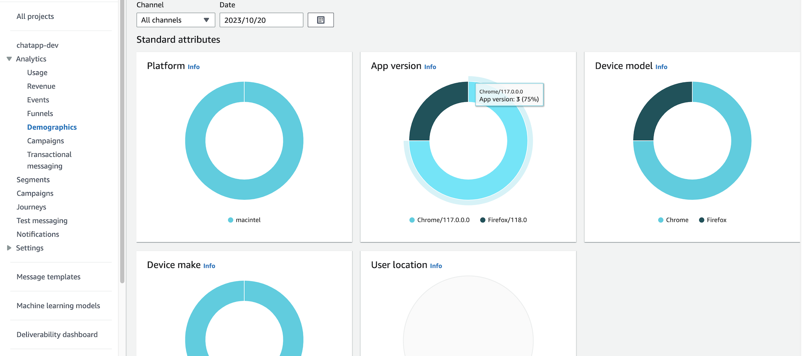
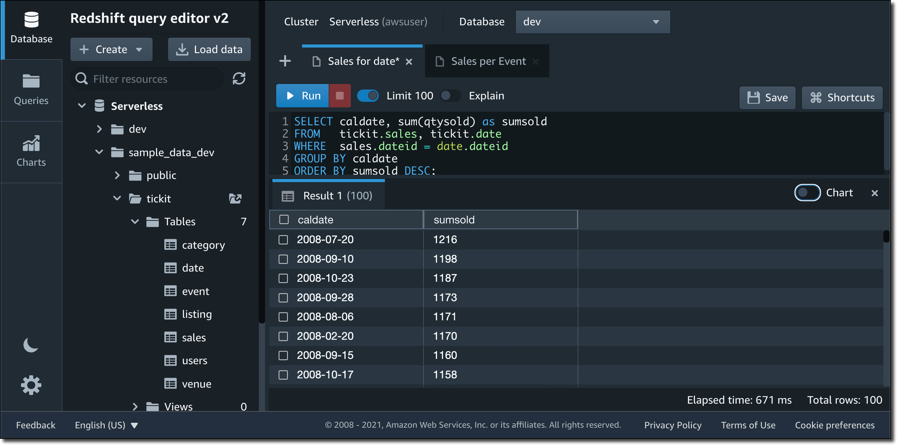

[[English](README.md)] [[한국어](README.ko.md)]

# Applications
## Amplified Amazon Analytics (A3)
Amplified Amazon Analytics (A3) is a solution for digital marketing. It helps you analyze customer behavior on the web and in your apps and build marketing strategies to read the market and make key business decisions through user behavior analysis. Additionally, it easily integrates with key AWS services to expand into the analytics and machine learning (ML) ecosystem.



## Pi


## Tickit
By using the web-based query editor, you don’t need to configure a SQL client or set up the network permissions to reach the serverless endpoint. Instead, you just write your SQL query and run it on web browser.



Redshift query editor provides quick access to a few sample datasets to make it easy to learn Amazon Redshift’s SQL capabilities: TPC-H, TPC-DS, and `tickit`. Tickit is a dataset containing information on ticket sales for events. For a quick test for Redshift analytics, you can use the tickit sample dataset so you don’t need to load any data. Here is a query example to get the list of tickets sold per date, sorted to see the dates with more sales first:

```
SELECT caldate, sum(qtysold) as sumsold
FROM   tickit.sales, tickit.date
WHERE  sales.dateid = date.dateid
GROUP BY caldate
ORDER BY sumsold DESC;
```

You can enable chart option on the right of the result table. You can select a bar chart.


# Known Issues
