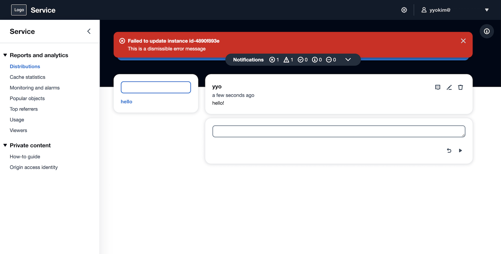
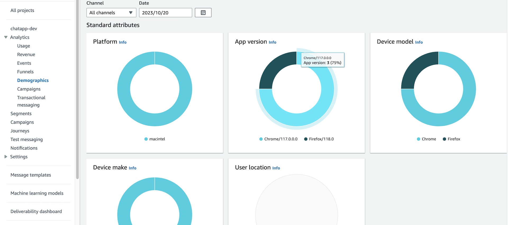
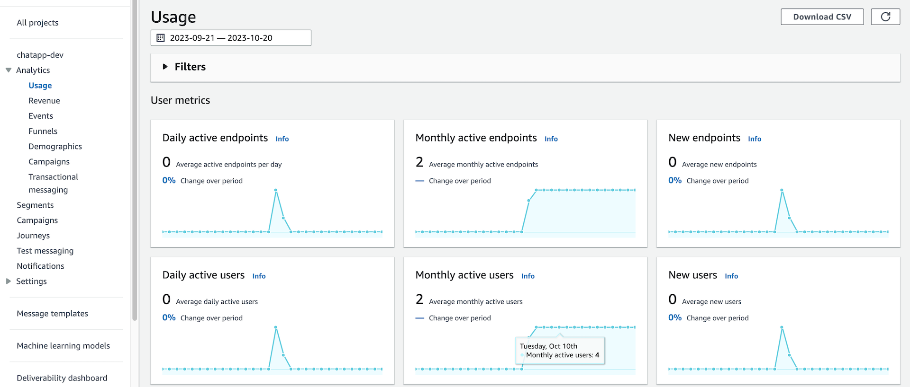
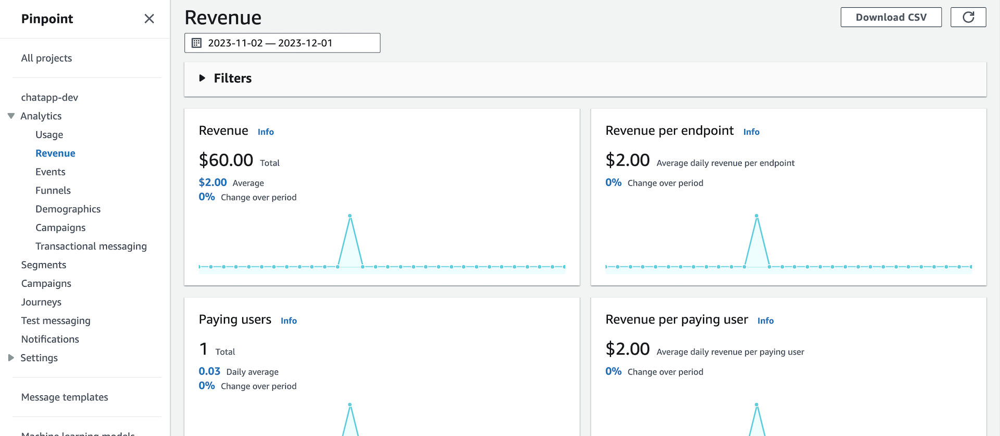

[[English](README.md)] [[한국어](README.ko.md)]

# Amplified Amazon Analytics (A3)
Amplified Amazon Analytics (A3) is a solution for digital marketing. It helps you analyze customer behavior on the web and in your apps and build marketing strategies to read the market and make key business decisions through user behavior analysis. Additionally, it easily integrates with key AWS services to expand into the analytics and machine learning (ML) ecosystem. For starters, AWS Amplify makes it easy to track user behavior on the web and in apps, and integrates with Amazon Pinpoint and Amazon Kinesis to analyze metrics, create dashboards, and manage campaigns. If you need more advanced features for things like machine learning and ad optimization, you can extend it with Amazon Redshift to extract behavior logs to perform SQL-based analysis and machine learning. If you need more dashboard functionality, you can also connect Amazon QuickSight to implement real-time visualization.

## ChatApp
ChatApp is a sample application to show how A3 works for digital marketing platform. This chat application is a react web app with [Cloudscape](https://cloudscape.design/) which is a prebuilt web-ui compoments for rapid development and AWS Amplify and AWS serverless services, such as AWS Cognito, AWS AppSync, Amazon DynamoDB.

**Application**\


**Analytics Dashboard**\




## Getting Started
### Install React packages
Move the *terraform-aws-emr/examples/blueprint/apps/a3* directory. And install reactstrap and npm dependencies on your workspace to build the application. Run npm-install command to download and install packages:
```
npm install reactstrap
```
You can try to use 'force' options to install packages and dependencies, if you see error.
```
npm install reactstrap --force
```

### Install Amplify CLI
The Amplify command-iine interface (CLI) is a unified toolchain to create AWS cloud services for your app. To install the amplify-cli on your workspace, vist the [developer guide](https://docs.amplify.aws/cli/start/install/) and follow the instructions.

**macOS**
```
brew install node
npm install -g @aws-amplify/cli
```

### Initialize an Amplify application
You can start to build an application from scratch using amplify-cli `init` command.\
Run command:
```
amplify init
```
(Optional),Create amplify environment.
```
amplify env list
amplify env add dev
amplify env checkout dev
```
### Add an Identity and Access Management service
```
amplify auth add
> Cognito User Pool
> Default configuration
> Username
```

### Add a GraphQL API service
```
amplify api add
> Change the auth mode config to Cognito User Pool
> Blank Schema
```
[Important] You must replace the auto-generated graphql.schema file by amplify-cli in the previous step with pre-defined model schema to run this example porperly.
Copy the graphql.scheam file under the src/graphql directory in your project directory, cloned local repository.
```
cp src/graphql/schema.graphql amplify/backend/api/chatapp/graphql.schema
```
Then, update the api configuration using amplify-cli. You can see an update on your local server configuration. 
```
amplify api update
```

### Add Analytics platform
```
amplify add analytics
> Amazon Pinpoint
```

### Apply changes
And apply changes on your AWS environment. Thia step will create your backend infrastructure on your AWS account such as Amazon Cognito (Auth), AWS AppSync (API), and Amazon DynamoDB (Database).
```
amplify push
```

### Open Analytics Dashboard
Once we have created the resources, we can run this command to open the Amazon Pinpoint console. Initially, all charts should be empty:
```
amplify console analytics
```

## Additional Resources
- [Amplify CLI enables creating Amazon Cognito User Pool Groups, configuring fine-grained permissions on groups, and adding user management capabilities to applications](https://aws.amazon.com/ko/blogs/mobile/amplify-cli-enables-creating-amazon-cognito-user-pool-groups-configuring-fine-grained-permissions-on-groups-and-adding-user-management-capabilities-to-applications/)
- [Amplify UI Troubleshooting](https://ui.docs.amplify.aws/react/getting-started/troubleshooting)
- [Amplify Analytics Automatic tracking](https://docs.amplify.aws/lib/analytics/autotrack/q/platform/js/)
- [AWS Messaging and Targeting](https://aws.amazon.com/blogs/messaging-and-targeting/)
- [Understanding the Different Ways to Invoke Lambda Functions](https://aws.amazon.com/blogs/architecture/understanding-the-different-ways-to-invoke-lambda-functions/)
- [Simplify access to multiple microservices with AWS AppSync and AWS Amplify](https://aws.amazon.com/blogs/mobile/appsync-microservices/)
- [AWS CDK Workshop](https://cdkworkshop.com/)
