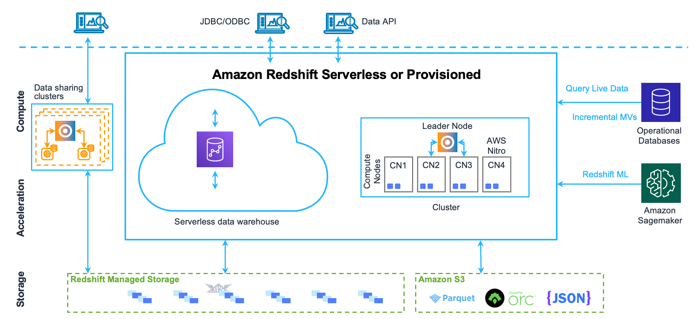

# Amazon Redshift
[Amazon Redshift](https://aws.amazon.com/redshift/) is a data warehouse product which forms part of the larger cloud-computing platform Amazon Web Services (AWS). Amazon Redshift uses SQL to analyze structured and semi-structured data across data warehouses, operational databases, and data lakes, using AWS-designed hardware and machine learning to deliver the best price performance at any scale.



## Setup
### Prerequisites
This module requires *terraform*. If you don't have the terraform tool in your environment, go to the main [page](https://github.com/Young-ook/terraform-aws-emr) of this repository and follow the installation instructions.

### Quickstart
```
module "vpc" {
  source  = "Young-ook/vpc/aws"
}

module "redshift" {
  source  = "Young-ook/emr/aws//modules/redshift"
  vpc     = module.vpc.vpc.id
  subnets = values(module.vpc.subnets["public"])
}
```
Run terraform:
```
terraform init
terraform apply
```

# Additional Resources
## Amazon Redshift
- [Amazon Redshift System and Architecture Overview](https://docs.aws.amazon.com/redshift/latest/dg/c_redshift_system_overview.html)

## Amazon Redshift Serverless
- [Compute capacity for Amazon Redshift Serverless](https://docs.aws.amazon.com/redshift/latest/mgmt/serverless-capacity.html)
- [Introducing Amazon Redshift Serverless – Run Analytics At Any Scale Without Having to Manage Data Warehouse Infrastructure](https://aws.amazon.com/blogs/aws/introducing-amazon-redshift-serverless-run-analytics-at-any-scale-without-having-to-manage-infrastructure/)
